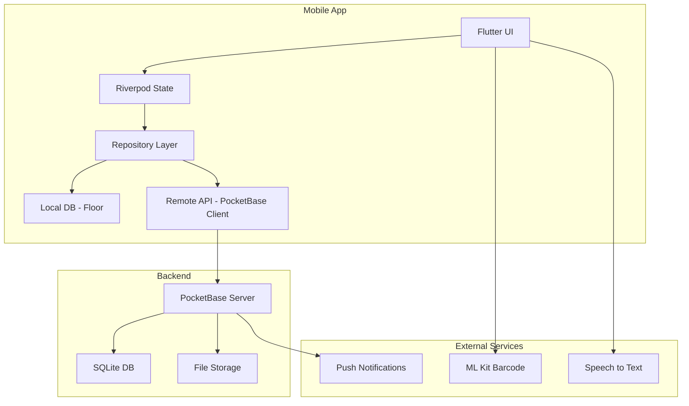

# Liquor Journal Architecture

## Overview

Liquor Journal is built as a monorepo containing:
- Flutter mobile application (iOS & Android)
- PocketBase backend server
- Docker infrastructure for deployment

## System Architecture

## Data Flow

1. **Online Mode**: UI → Repository → PocketBase API → Server DB
2. **Offline Mode**: UI → Repository → Floor Local DB → Sync Queue
3. **Sync Process**: Sync Queue → PocketBase API → Conflict Resolution

## Key Design Decisions

### Offline-First Architecture
- All data operations write to local Floor database first
- Background sync service handles server updates
- Conflict resolution favors most recent timestamp

### Clean Architecture Layers
- **Presentation**: Flutter widgets and screens
- **Domain**: Business logic and entities
- **Data**: Repositories, DTOs, and data sources

### State Management
- Riverpod for dependency injection and state
- StateNotifier for complex state logic
- FutureProvider for async data fetching

## Security Considerations

- JWT token storage in secure storage
- API rate limiting on PocketBase
- Input validation on both client and server
- Image compression before upload

## Performance Optimizations

- Lazy loading for large lists
- Image caching with size variants
- Database indexing on frequently queried fields
- Debounced search queries